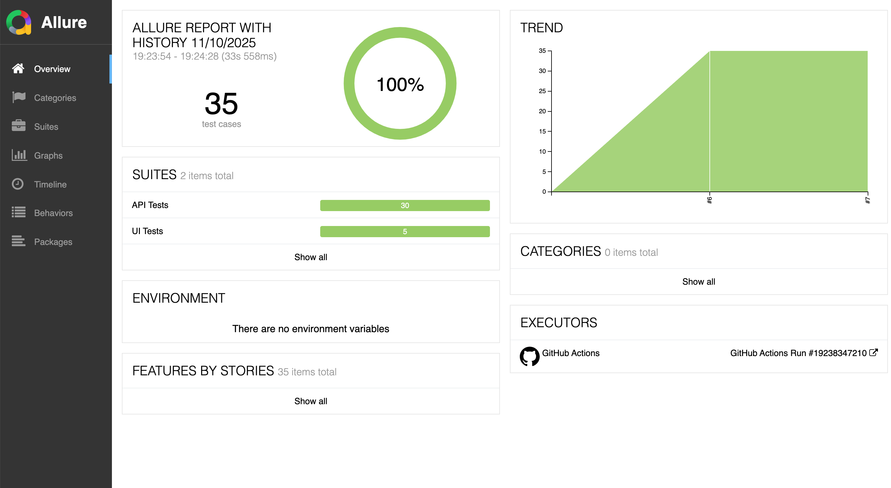
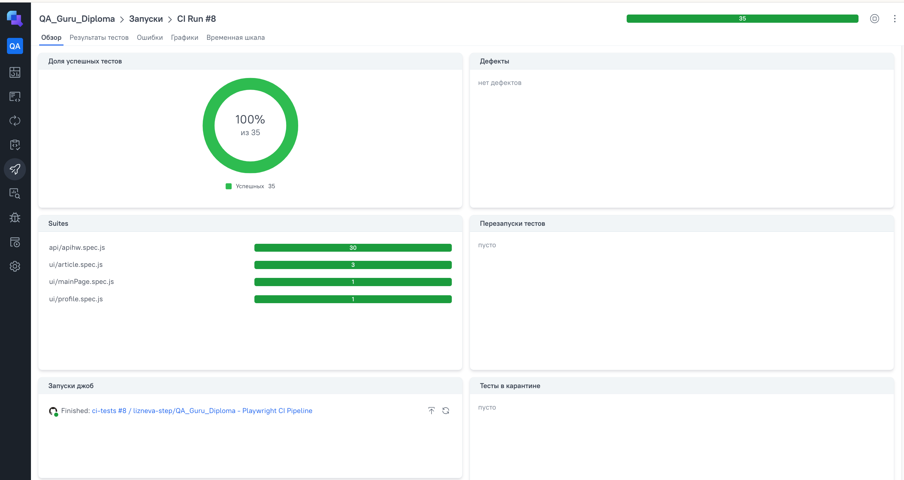
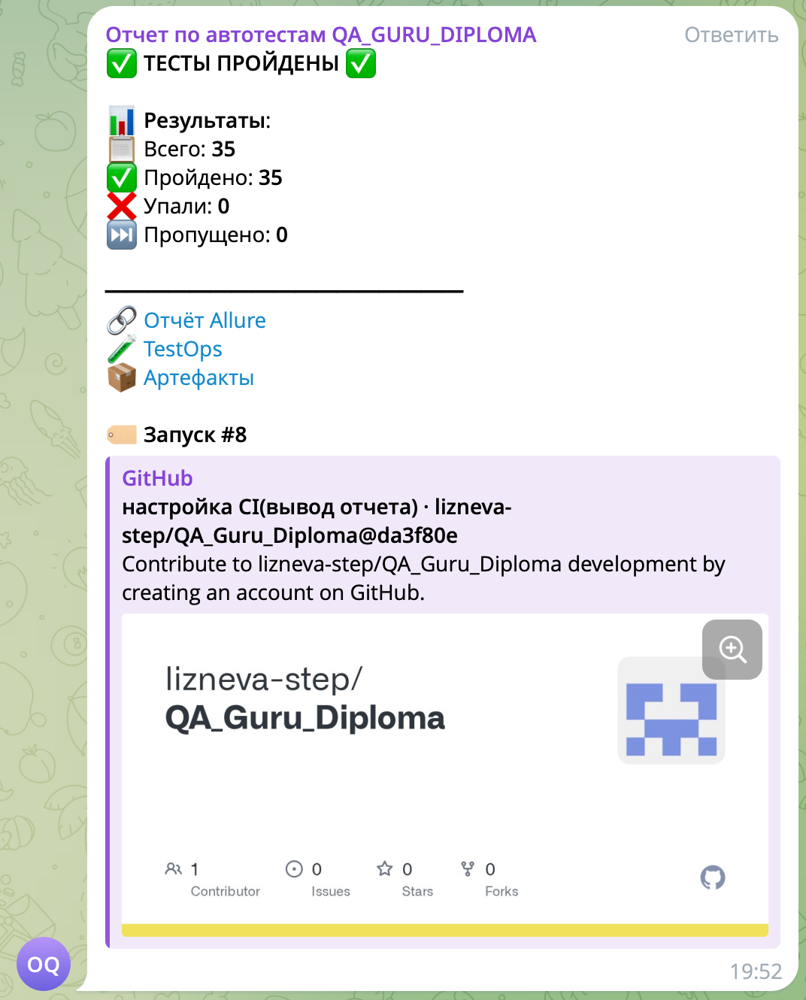

# Дипломный проект по автоматизации тестирования на Playwright

Цель дипломного проекта — продемонстрировать навыки автоматизации тестирования, полученные в рамках курса QA.GURU
Проект включает **UI и API тесты**, настроенный **CI/CD**, **отчёты**, **интеграцию с TestOps** и **уведомления в Telegram**.

---

## 📚 Содержание
- [Описание](#-описание)
- [Технологии](#-технологии)
- [Пример Allure-отчёта](#-пример-allure-отчёта)
- [Интеграция с Allure TestOps](#-интеграция-с-allure-testops)
- [Уведомления в Telegram](#-уведомления-в-telegram)

---

## 📝 Описание

Репозиторий содержит:
- **API-тесты** для `https://apichallenges.herokuapp.com`
- **UI-тесты** для `https://realworld.qa.guru`
- Написаны на **JavaScript** с использованием **Playwright**
- Настроен **GitHub Actions** как CI:
  - Запуск тестов
  - Генерация Allure-отчётов
  - Публикация на GitHub Pages
  - Интеграция с Allure TestOps
  - Отправка уведомлений в Telegram

Все тесты запускаются автоматически при пуше в `main` или `master`.

---

## 🛠 Технологии

  
  
  
  
  
  

---

## 📊 Пример Allure-отчёта

[👉 Открыть Allure-отчёт (GitHub Pages)]([https://lizneva-step.github.io/QA_Guru_Diploma)

> Отчёт генерируется после каждого запуска и публикуется на GitHub Pages.

---

## 🔗 Интеграция с Allure TestOps

[👉 Перейти в Allure TestOps отчет](https://allure.autotests.cloud/launch/49425/?treeId=0)

> Результаты тестов автоматически загружаются в Allure TestOps для анализа, трендов и баг-трекинга.

---

## 📢 Уведомления в Telegram

После каждого запуска приходит уведомление с результатами:

> Уведомление содержит:
> - Статус запуска ✅ ТЕСТЫ ПРОЙДЕНЫ ✅ или ❌ ОШИБКИ В ТЕСТАХ ❌
> - Общее количество тестов
> - Количество пройденных/упавших тестов
> - Ссылки на отчёты и артефакты

---

## 🏁 Запуск локально

1. Клонируй репозиторий: git clone https://github.com/lizneva-step/QA_Guru_Diploma.git
2. Установи зависимости: npm install
3. Запусти тесты npx playwright test

 ## 📂 Структура проекта
QA_Guru_Diploma/
├── tests/
│   ├── api/          # API-тесты
│   └── ui/           # UI-тесты
├── src/              # Вспомогательные классы и сервисы
├── .github/
│   └── workflows/    # GitHub Actions
├── allure-results/   # Результаты Allure
├── test-results/     # Артефакты (скриншоты, трейсы)
└── README.md
